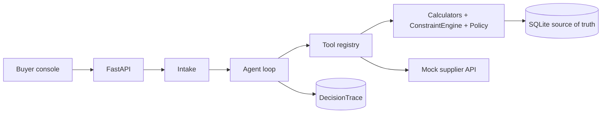
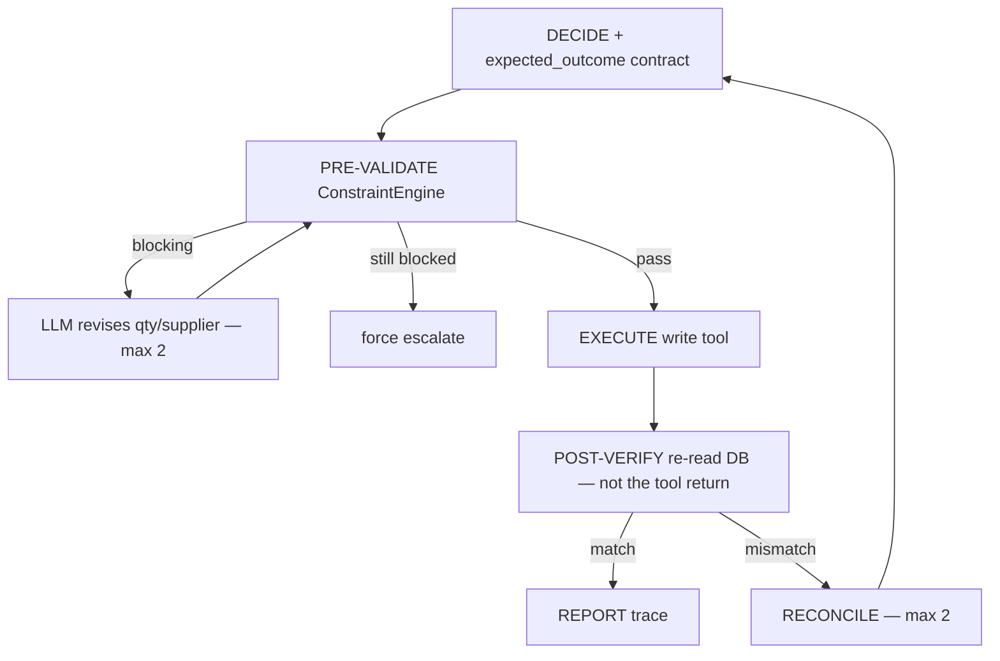
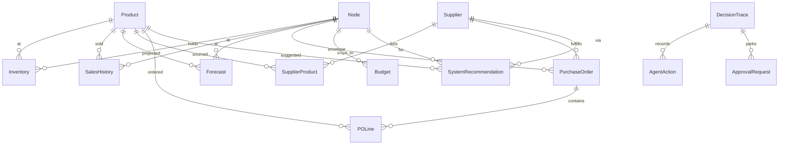

# AI Purchasing Agent

An LLM-orchestrated purchasing agent for a retail / quick-commerce buyer desk. It is **not a chatbot**. It investigates a purchasing situation, decides, **acts**, then **validates** the result of its own action against the database.

The system recommendation handed to the agent may be **wrong**. The agent can reject it, modify it, investigate further, or escalate. Arithmetic and constraint checks never live in the prompt: they live in Python.

Clock is frozen at **2026-09-15**. Default `LLM_PROVIDER=fake` (canned scripts). Evals need no API key.

---

## 1. What this is + 60-second demo

A buyer-desk agent: given a recommendation, a supplier shortfall, a demand change, or a constrained buy, it must call tools, run `compute_replenishment_plan`, pre-validate with the constraint engine, maybe write a PO, then re-read the DB and reconcile if reality disagrees with the contract it declared.

### Terminal (works even if the UI is broken)

From the repo root (the folder that contains `Makefile`):

```bash
make setup && make demo
```

`make demo` seeds the Scenario 1 world into a temp SQLite file and runs the **overbuy** variant with FakeLLM. You should see a readable trace ending in `REJECT`. What to look for:

- `get_recommendation` loads `REC-OVERBUY` for `SKU-COVERED` qty **800**
- `get_open_purchase_orders` shows `PO-COVERED:confirmed:800`
- `compute_replenishment_plan` returns `rounded_qty=0`, `incoming=800`, cover **38.4** days
- `validate_action` **fails**; binding constraint is `total_cover_within_max_weeks_of_supply` (C12), with C8 also cited
- `ACT` is `(no write for decision=reject)` — no new PO
- `verdict   REJECT`

Exact output shape:

```
PLAN            (Plan: load REC-OVERBUY, open POs, replenishment plan, then decide. Hypothesis only.)
INVESTIGATE    get_recommendation
              id=REC-OVERBUY sku=SKU-COVERED qty=800 supplier=SUP-RELIABLE
INVESTIGATE    get_open_purchase_orders
              open=1 PO-COVERED:confirmed:800
INVESTIGATE    compute_replenishment_plan
              rounded_qty=0 incoming=800.0 cover_days=38.4 stockout=2026-10-23 cost=0.0
DECIDE         decision=reject
ACT             (no write for decision=reject)
POST-VERIFY     matched=True diffs=[]
verdict   REJECT
```

Other S1 variants (still no UI): `cd backend && .venv/bin/python -m app.demo --variant healthy` (expect **accept** + a PO) or `--variant moq` (expect **escalate**).

### Operator console (optional)

```bash
make setup && make seed && make dev
```

1. Open [http://localhost:5173](http://localhost:5173). Header should read **api ok**. If it says **api unreachable**, stop and restart `make dev-backend` (port 8000 has hung on `/health` in this workspace before).
2. You are on **Situations** (key `1`). Find the card `recommendation-review` / **S1 Purchase Recommendation Review**.
3. Leave the variant dropdown on **REC-OVERBUY — reject (open PO already covers)**.
4. Click **Run agent**. The console reseeds that world and navigates to **Run** (key `2`).
5. Look for: a **REJECT** chip in the middle column; C8 / C12 meters in the right column; the left timeline showing `compute_replenishment_plan` then `DECIDE`.
6. Press `3` (**Validation**). There should be **no write**, post-verify matched, no mismatch banner.
7. Press `5` (**Purchase Orders**). `PO-COVERED` is still the inbound 800; no agent-created PO.

Keys `1`–`6` switch Situations / Run / Validation / Approvals / Purchase Orders / Evaluation. Full four-scenario walkthrough: [DEMO.md](DEMO.md).

---

## 2. One-command setup

```bash
make setup && make seed && make dev
```

| Command | What it does |
| --- | --- |
| `make setup` | Copies `.env.example` → `.env` if missing, creates `backend/.venv`, installs Python + frontend deps |
| `make seed` | Seeds the `base` world into SQLite (`DB_URL`) |
| `make dev` | API on [http://localhost:8000](http://localhost:8000) and console on [http://localhost:5173](http://localhost:5173) |
| `make demo` | Seeds Scenario 1 and prints a terminal trace (no servers) |
| `make test` | `pytest` |
| `make eval` | `python -m evals.run --suite all --repeat 3 --llm fake` |

Or:

```bash
docker compose up --build
```

Compose publishes the API on `:8000` and the console on `:5173`. Seed from the UI (**Run agent** reseeds that scenario's world) or:

```bash
docker compose exec backend python -m app.db.seed --world base
```

### `.env.example`

| Variable | Role |
| --- | --- |
| `ANTHROPIC_API_KEY` | Required only for `LLM_PROVIDER=anthropic`. Leave empty for demos and evals. |
| `LLM_MODEL` | Default `claude-sonnet-4-20250514`. Ignored by FakeLLM. |
| `LLM_PROVIDER` | `fake` (default) or `anthropic`. |
| `AUTONOMY_MAX_ORDER_VALUE` | USD envelope. Orders above this go to the approval queue, they are **not** constraint-refused. Default `5000`. |
| `DB_URL` | SQLite URL. Default `sqlite:///./purchasing_agent.db` (created under `backend/` when the API cwd is `backend/`). |
| `SUPPLIER_API_MODE` | `fixture` — mock supplier behaviour comes from YAML / `api_behaviour`, never from randomness. |

**The eval suite runs with `LLM_PROVIDER=fake` and needs no API key.** `make eval` passes `--llm fake` regardless of `.env`. CI and the Evaluation screen do the same.

---

## 3. Approach

The assignment is a purchasing **control loop**, not a chat. I split the problem so the model can be wrong about judgement without being able to be wrong about arithmetic or invariants.

**LLM judgement.** What kind of situation is this? Which tools to call? Is the recommendation a hypothesis or a trap? Accept / modify / reject / investigate / escalate? What compensating action after a mismatch?

**Deterministic computation.** Coverage days, safety stock, net requirement, supplier rounding, landed cost, storage footprint, demand stats (spike vs promo anomaly). All of that is `backend/app/domain/calculators.py`, exposed as `compute_replenishment_plan`. The loop **requires** that tool before DECIDE. The model is not allowed to add 140 × $1.25 in prose.

**Constraints are an engine, not prompt text.** C1–C12 live in `ConstraintEngine.evaluate`. Write tools call `_evaluate_or_refuse` and raise `ConstraintRefused` (transaction rolls back). The LLM cannot “decide” that MOQ is satisfied. `validate_action` is how it *asks*. Prompting “please respect MOQ” would fail the first time the model is tired, jailbroken, or confidently wrong. An engine fails closed.

**Decision taxonomy** (Pydantic `Decision.decision`, one of five plus implicit “do not write”):

| Class | Meaning | Typical write |
| --- | --- | --- |
| `accept` | Recommendation (or short-confirmed PO) is feasible as-is | `create_purchase_order` at rec qty, **or no write** when accepting a shortfall that still covers |
| `modify` | Right direction, wrong qty or supplier | `create_purchase_order` / `modify_purchase_order` at a feasible qty |
| `reject` | Do not buy. Over-cover, promo spike, redundant rec | no buy |
| `investigate_further` | Missing node, stale forecast, not enough evidence to size a buy | no buy |
| `escalate` | Hard constraint with no feasible alternative, or post-verify mismatch | `escalate` / `request_human_approval` — never a blocked qty |

Autonomy (`AutonomyPolicy`) is a third layer: even a constraint-clean PO above $5000, below reliability 0.70, or below confidence 0.60 is parked `pending_approval`. That is configuration, not a sentence in the system prompt.

---

## 4. Architecture

Full diagrams: [docs/architecture.md](docs/architecture.md).



The write path is an explicit cycle. The LLM cannot skip a stage:



Scenario 2 sequence (this is the default `gap` run). The inbound short is already on `PO-SHORTFALL`. The top-up supplier (`SUP-FAST`) is fixture-configured `partial_accept` ratio 0.6, so the agent's own write misses `expected_outcome` and recovery runs:

```mermaid
sequenceDiagram
  participant Agent
  participant Tools
  participant DB
  participant Supplier as Mock supplier API

  Agent->>Tools: get_open_purchase_orders (PO-SHORTFALL)
  Agent->>DB: inventory + forecast + other open POs
  Agent->>Tools: compute_replenishment_plan
  Note over Agent: on-hand 70 + 250 arriving 22-Sep; stockout 20-Sep
  Agent->>Tools: find_alternate_suppliers
  Agent->>Tools: validate_action qty=80 supplier=SUP-FAST
  Agent->>Agent: DECIDE modify + expected_outcome.po_status=confirmed
  Agent->>Tools: PRE-VALIDATE then create_purchase_order (QuickShip 80)
  Tools->>Supplier: submit
  Supplier-->>Tools: partial_accept 48 of 80
  Tools->>DB: persist partially_confirmed
  Agent->>DB: POST-VERIFY
  Note over Agent: matched=false diffs po_status confirmed vs partially_confirmed
  Agent->>Agent: RECONCILE
  Agent->>Tools: escalate (compensating action)
  Agent->>DB: re-verify (no further buy)
  Agent->>Agent: REPORT escalate — never completed/success
```

Caps: 12 LLM turns, 80k tokens. Stages: INTAKE → PLAN → INVESTIGATE → DECIDE → PRE-VALIDATE → ACT → POST-VERIFY → RECONCILE → REPORT.

---

## 5. Data model and mock data



Source of truth is SQLite. The mock supplier API is not source of truth: after a write, post-verify re-reads `PurchaseOrder` / `POLine` / `Budget` / inventory-derived cover from the DB. `EventLog` and `IdempotencyRecord` are audit / replay tables (full ER in [docs/architecture.md](docs/architecture.md)).

**What is seeded and why.** `backend/fixtures/base_world.yaml` is the catalogue; scenario files `include` it and overlay the situation. Sales expand to 120 days, forecasts to 56, `random_seed=42`, `as_of=2026-09-15`. Each SKU exists to make one trade-off *true*, not to look realistic:

| SKU / entity | Why it exists |
| --- | --- |
| `SKU-HEALTHY` | Rec **140** is actually right (on-hand 100, Acme 7-day lead beats stockout). Accept case. |
| `SKU-COVERED` / `PO-COVERED` | Rec **800** is over-buy; confirmed inbound 800 already covers. C8/C12. |
| `SKU-MOQ` | True need ~320 vs Acme MOQ **1000**. Rounding is a modify until C7/C12 block, then escalate. |
| `SKU-BUDGET` | Coffee remaining **$600**; 400 × $16 = $6400. Even MOQ 50 = $800. `suggested_max=0`. |
| `SKU-STORAGE` | DC-SOUTH is **15 m³**. Rec 800 cereal does not fit; `suggested_max_feasible_qty=96`. |
| `SKU-ALT` / `PO-SHORTFALL` | 500 ordered, **250** confirmed, arriving 22-Sep. On-hand 70 stocks out 20-Sep. QuickShip (`SUP-FAST`) is faster, dearer, and **partial_accept 0.6** in the S2 world so the top-up write recovers. |
| `SKU-ENVELOPE` | Constraint-clean 100 × $55 = **$5500**. Parks `pending_approval` at the default $5000 envelope. |
| `SKU-SPIKE` | `spike_detected`; forecast still ~18 u/day. True step-change vs stale rec 180. |
| `SKU-PROMO` | `anomaly_flag`; rec 600 treats a one-off invoice as run-rate. Anti-overreaction. |
| `SKU-UNRELIABLE` / `SUP-UNRELIABLE` | Reliability **0.41**, below the 0.70 floor. `PO-GHOST` is an overdue submitted PO. |
| `supplier_shortfall_covered.yaml` | Overlay on-hand **2000** so E7 can accept the 250 short with no new PO. |

Nodes: `DC-NORTH` (800 m³) and `DC-SOUTH` (15 m³). Suppliers: Acme (`SUP-RELIABLE`, `full_accept`), QuickShip (`SUP-FAST`, `full_accept` in base, `partial_accept` ratio 0.6 in the S2 world), Bargain Cash & Carry (`partial_accept` ratio 0.5). Worlds: `base`, `recommendation_review`, `supplier_shortfall`, `demand_change`, `constrained_buy`.

---

## 6. Tools / API reference

Every tool is registered in `backend/app/tools/`. The LLM may only call this list. Writes set `is_write=True` and go through the pre-validate / execute / post-verify cycle.

| Tool | Purpose | R/W | Constraints enforced |
| --- | --- | --- | --- |
| `get_recommendation` | Load a system rec. Treat as hypothesis. | read | — |
| `get_product` | Product master by SKU. | read | — |
| `get_inventory` | On-hand / reserved / in-transit / damaged. | read | — |
| `get_demand_stats` | Mean, std, trend, `spike_detected` vs `anomaly_flag`. | read | — |
| `get_forecast` | Forward forecast units. | read | — |
| `get_sales_history` | Daily units sold. | read | — |
| `get_open_purchase_orders` | Open POs, optional sku/node/supplier filter. | read | — |
| `get_supplier_terms` | Price, MOQ, multiple, lead time. | read | — |
| `find_alternate_suppliers` | Ranked price → lead → reliability. | read | — |
| `get_supplier_performance` | Fill, on-time, lead variance, reliability. | read | — |
| `get_budget` | Remaining envelope for node/category. | read | — |
| `get_storage_capacity` | Node cube and current footprint. | read | — |
| `compute_replenishment_plan` | Full deterministic bundle (cover, SS, ROP, net need, rounding, cost, cube). **Required before DECIDE.** | read | Rounding is computation, not a pass/fail. |
| `validate_action` | `ConstraintEngine.evaluate`. The model may not claim a constraint holds without this. | read | Reports C1–C12; does not write. |
| `create_purchase_order` | Create + submit (or park pending_approval). | write | C1–C12 via `_evaluate_or_refuse`. Autonomy policy after that. |
| `modify_purchase_order` | Change ordered qty. | write | Increases re-run C1–C12. |
| `split_purchase_order` | Move qty onto a remainder supplier. | write | New slice re-runs C1–C12. |
| `cancel_purchase_order_line` | Cancel a line; release committed budget if live. | write | No buy checks (cannot cancel a received line). |
| `request_human_approval` | Park an action on the queue with options. | write | None (does not buy). |
| `escalate` | Escalate with context. Does not place an order. | write | None. |
| `log_decision` | Persist a decision payload on the audit trail. | write | None. |

HTTP (OpenAPI at `/docs`): `POST /agent/run`, `POST /agent/run/recommendation-review`, `…/supplier-shortfall`, `…/demand-change`, `…/constrained-buy`, `GET /traces`, `GET /traces/{id}`, `GET/POST /approvals…`, `GET /pos`, `GET /evals`, `POST /evals/run`, `POST /scenarios/{id}/seed`.

C1–C12: `budget_sufficient`, `storage_capacity_available`, `moq_satisfied`, `order_multiple_satisfied`, `max_order_qty_respected`, `supplier_active_and_sells_product`, `lead_time_beats_stockout`, `no_redundant_coverage_with_open_pos`, `shelf_life_vs_cover_days`, `receiving_capacity_per_day`, `supplier_reliability_floor`, `total_cover_within_max_weeks_of_supply`. HARD vs WARN is in `constraints.py`; WARN never refuses a write.

---

## 7. How decisions are validated

A write is illegal unless it survives this pipeline. The LLM cannot override it.

1. **DECIDE** emits a Pydantic `Decision`. Schema retry once. `reasoning_summary` ≤ 6 sentences. Buy decisions must include an **`expected_outcome` contract**: the fields the agent believes will be true *after* the write (`po_status`, `ordered_qty`, `committed_cost`, `budget_remaining_after`, `storage_used_after`, `projected_cover_days`, `stockout_risk`, `expected_delivery_date`). `None` fields are skipped in the diff, so omitting a field is allowed; lying about a field is not.
2. **PRE-VALIDATE.** The loop calls `validate_action` / `ConstraintEngine` on a `ProposedAction` **assembled from the DB**, not from a hand-built payload the model might smuggle. Blocking violations: the model may revise qty/supplier at most **twice**, then the loop **force-escalates**. Constraint breaches are **refused**, never sent to the approval queue.
3. **EXECUTE.** Write tool runs `_evaluate_or_refuse` again (defense in depth), applies autonomy policy, talks to the mock supplier API, persists PO status from the supplier result (`confirmed` / `partially_confirmed` / `cancelled` / `submitted` on timeout). Idempotency keys stop double-orders.
4. **POST-VERIFY.** `collect_source_of_truth` re-reads the DB (not the tool return). `post_verify` diffs each non-null `expected_outcome` field with `_close` (numeric slack 1% / 0.05).
5. **RECONCILE.** On mismatch, at most **two** rounds: the model is shown the diffs and must compensate or escalate. After two unmatched rounds the loop force-escalates. Reporting `completed` + `matched: true` after a broken write **fails the recovery grader**.
6. **Escalation** is the safe sink: `escalate` does not buy.

### Real mismatch, caught and recovered (E11)

Eval E11 runs the healthy accept script against Acme with `force_reject: true`. The agent believes it placed a clean 140-unit PO (`expected_outcome.po_status = confirmed`). The supplier API rejects it; the DB stores `cancelled`. Post-verify diffs that field; reconcile asks for a compensating action; the canned recovery script escalates and does **not** report success.

Captured from a live `run_once(E11)` on 2026-09-15 (FakeLLM). Trace `TR-6c63ab4e90`, final status `escalated`:

```text
DECIDE
  decision=accept  final_quantity=140
  reasoning_summary: "REC-HEALTHY 140 is feasible. compute_replenishment_plan
    rounded_qty is 100 at unit price 1.25. validate_action passed for 140.
    Acme lead 7 days beats the stockout."

PRE-VALIDATE  tool=validate_action  passed=true

ACT  tool=create_purchase_order
  po_id=PO-da8bdd525d  po_status=cancelled
  supplier_accepted=false
  supplier_message="Supplier rejected the order (forced MOQ / policy reject)."

POST-VERIFY
  verification: {
    "matched": false,
    "diffs": [
      {"field": "po_status", "expected": "confirmed", "actual": "cancelled"}
    ]
  }

RECONCILE
  {
    "matched": false,
    "diffs": [{"field": "po_status", "expected": "confirmed", "actual": "cancelled"}],
    "reconciliation_rounds": 0,
    "remaining_rounds": 2,
    "action": "revise",
    "reason": "Persisted state does not match expected_outcome. Choose a
      compensating action: top-up from an alternate supplier, split the PO,
      reduce and re-plan, or escalate with options."
  }

DECIDE
  decision=escalate  final_quantity=null
  reasoning_summary: "create_purchase_order submitted 140 but the supplier API
    rejected it; post-verify po_status is cancelled not confirmed. I will not
    report success. Escalating to re-source or retry."

ACT  tool=escalate
  escalated=true
  reason="Supplier rejected a constraint-clean PO. Buyer should re-source."

POST-VERIFY  matched=true  diffs=[]
REPORT
```

Final `DecisionTrace.verification` after the escalate (no buy contract) is `{ "matched": true, "diffs": [] }`. The **first** post-verify is the catch; the second is the recovery. E12 is the sibling: `confirm_then_revise` adds 9 days of lead time vs `expected_delivery_date` `2026-09-22`.

---

## 8. Human-in-the-loop policy

Implemented in `backend/app/domain/policy.py`. Thresholds are settings, not prompt text.

| Gate | Default | If breached |
| --- | --- | --- |
| Order value | `AUTONOMY_MAX_ORDER_VALUE=5000` USD | `pending_approval` |
| Supplier reliability | **0.70** | `pending_approval` |
| Decision confidence | **0.60** | `pending_approval` |
| C1–C12 HARD fail | engine | **Refused.** Not an approval. |

**Why these numbers.**

- **$5000.** Routine replenishment stays autonomous (SKU-HEALTHY 140 × $1.25 = $175). `SKU-ENVELOPE` is the reviewer-visible gate: 100 × $55 = $5500 is constraint-clean and parks `pending_approval` with the default setting — no injected `max_order_value`. Coffee 400 × $16 is still killed by C1 before policy.
- **0.70 reliability.** Bargain Cash & Carry is **0.41** (below); QuickShip **0.86** and Acme **0.94** (above). Auto-send money to a 52% on-time vendor is the failure mode this gate exists for. It does **not** replace C11 (warn-only on the engine).
- **0.60 confidence.** Below that the model is guessing. Scripts in this repo sit at 0.7–0.95, so the gate is idle in FakeLLM evals and live when a real model hedges.

The approval queue (`request_human_approval`, UI **Approvals**, key `4`) is for envelope misses. **Approve** re-enters the loop: submit the parked PO, then post-verify against the original contract. **Modify-and-approve** re-runs constraints at the new qty. Constraint-blocked actions never appear here.

---

## 9. Evaluation

Seven independent graders. There is **no** single opaque score. A case passes only if every dimension passes. Stability is the share of repeats that matched the modal `(decision, pass-vector)`.

| Dimension | What it checks |
| --- | --- |
| `decision_correctness` | Decision class ∈ allowed set; qty in range when specified |
| `information_sufficiency` | Required tools called **before** DECIDE |
| `constraint_respect` | Asserted on the **DB** after the run (budget, storage, C-codes on agent POs) |
| `action_correctness` | Expected write / no-write / escalate actually happened |
| `validation_performed` | PRE-VALIDATE + POST-VERIFY + `expected_outcome` on write decisions |
| `recovery` | Failure-injection cases: mismatch detected, no fake success |
| `explanation_quality` | `key_factors` cite `source_tool`; numbers in the reasoning appear in a tool result |

### Case list

| ID | Situation | Expected |
| --- | --- | --- |
| E1 | REC-HEALTHY is right | `accept` 100–160, create PO |
| E2 | REC-OVERBUY, inbound already covers | `reject`, no write |
| E3 | Need ~320 vs MOQ 1000 | `escalate` (or modify then escalate) |
| E4 | Coffee budget $600 vs $6400 | `escalate`, never buy 400 |
| E5 | South cube | `modify` **96**, not 800 |
| E6 | Acme lead misses stockout | `escalate` or switch supplier; do not buy Acme |
| E7 | 500→250 but on-hand 2000 | `accept` the short, no new PO |
| E8 | 500→250, QuickShip top-up partial-confirms 48/80 | detect, RECONCILE, `escalate` |
| E9 | True spike | `modify` **240** |
| E10 | Promo one-off | `reject` |
| E11 | Supplier rejects a clean PO | detect, recover, `escalate` |
| E12 | Confirm then silent lead-time revise | detect delivery-date diff, `escalate` |
| E13 | SKU-SPIKE at DC-SOUTH, no inventory row | `investigate_further` / `escalate`, never fabricate |

### Results

Sample report: `backend/evals/report.md` (`EV-20260915041847`, FakeLLM, suite `all`, repeat 3).

> These results use FakeLLM, which replays scripted tool-call sequences. They verify that the
> agent loop, constraint enforcement, pre-validation, post-verification and reconciliation
> plumbing behave correctly and deterministically. They are **not** a measure of model
> judgement — a scripted agent is perfectly stable by construction. Evaluating decision
> quality requires running `--llm real`, which needs an API key; expected real-LLM results
> are lower on both pass rate and stability.

| Case | Decision | Info | Constraint | Action | Validation | Recovery | Explain | Stability | Overall |
| --- | --- | --- | --- | --- | --- | --- | --- | --- | --- |
| E1–E13 | pass | pass | pass | pass | pass | pass | pass | 1.0 | **13/13 pass**, mean stability **1.0** |

Reproduce:

```bash
make eval
# or: cd backend && .venv/bin/python -m evals.run --suite all --repeat 3 --llm fake
```

Dashboard: console key `6`, or `POST /evals/run`.

### What the agent gets wrong / known limitations

- **FakeLLM stability 1.0 is not real-LLM stability.** E1–E13 pass because each case has a canned tool script. That measures the loop, the engine, and the grader — not Claude. A live `LLM_PROVIDER=anthropic` run is a different product.
- **Budget cannot partial-buy.** E4/`SKU-BUDGET`: remaining $600, MOQ 50 × $16 = $800, `suggested_max_feasible_qty=0`. Escalating is correct for this fixture. A better agent would still quantify stockout cost vs a budget-exception request; this one has no objective function, so it escalates rather than inventing a 37-unit (illegal) slice.
- **Two scripts, one world.** UI default for S3 `SKU-SPIKE` is `investigate_further` (stale forecast, do not guess a qty). Eval E9 uses a different script that `modify`s to 240. Likewise S2 `covered` in the console reseeds `supplier_shortfall` (on-hand 70) but FakeLLM still runs the accept-the-short script; the numbers that make that *correct* are the E7 overlay (`supplier_shortfall_covered`, on-hand 2000). A live model has to pick; the harness does not claim both are the same policy.
- **`stockout_risk` is a brittle contract field on writes.** Cover near 20 days is easy to call `low` vs `medium`. Write scripts usually **omit** it. Reject / investigate_further **skip** post-verify entirely (no noisy mismatch on a correct reject). Buy writes must declare `po_status`, `ordered_qty`, and `committed_cost` or post-verify fails with `incomplete_expected_outcome`.
- **Accept-the-short is easy to implement wrong.** An `accept` with `final_quantity=null` must **not** write and must **not** escalate. Early loop versions treated “accept without a qty” as an error. E7 depends on that being a no-op.
- **No forecast model.** Forward demand is a fixture series plus rolling mean/std. The agent can notice a stale forecast (`spike_detected`); it cannot produce a statistically revised one.
- **Single-node decisions.** It will not allocate a buy across DC-NORTH and DC-SOUTH.
- **Live API hang.** `:8000` has stopped answering `/health` under `--reload` in this workspace. The terminal demo does not use the API. For the UI, restart `make dev-backend`.
- **C11 is WARN.** Unreliable suppliers are an autonomy/policy issue, not a hard engine refuse, unless you also fail C6.

---

## 10. What I'd do next with more time

- **Multi-node optimisation.** Treat North + South as one inventory position with transfer lead time and different cube/receiving caps, instead of independent loops.
- **Cost-of-excess vs stockout-cost objective.** Today C7/C12 and `suggested_max` are feasibility cuts. The MOQ-1000 and budget-zero cases want an explicit objective: expected lost margin vs holding + expiry, so “escalate” comes with a dollar recommendation, not only a constraint name.
- **Learn from buyer overrides.** Log approve / reject / modify-and-approve as preference data. After N overrides on `SKU-PROMO`-like anomalies, raise the bar for treating a spike as run-rate — still outside the LLM, as a prior on `get_demand_stats`.
- **Vendor-managed inventory.** Some SKUs should not be agent-bought at all; the tool would be `propose_vmi_signal` plus a fill-rate SLA, with the same post-verify against inbound.
- **A proper forecasting model.** Replace the fixture series with a model that emits a revised mean and interval the calculators already consume (`confidence_low` / `confidence_high` are already on `Forecast`). Keep the LLM away from the numbers.

---

## Layout

```
backend/app/          FastAPI, domain, tools, agent loop, API, demo
backend/fixtures/     YAML worlds
backend/evals/        YAML cases, seven-dimension grader, sample report.md
backend/tests/
frontend/             React + Vite + Tailwind + TanStack Query
docs/architecture.md
DEMO.md
```

## Tests

```bash
make test
```
