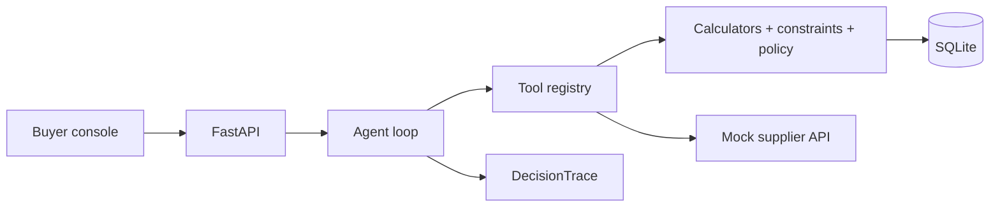

# AI Purchasing Agent

An LLM-orchestrated purchasing agent for a retail / quick-commerce buyer desk. It is **not a chatbot**. It investigates a purchasing situation, decides, **acts**, then **validates** the result of its own action against the source of truth.

The system recommendation given to the agent may be **wrong**. The agent can reject or modify it.

> This repo is being built incrementally (Prompts 0–8). Prompt 0 is the scaffold: typed modules, a working API `/health`, a working Vite console, and one-command run. Business logic is not implemented yet.

## 1. 60-second demo (scaffold)

```bash
cp .env.example .env
make setup
make dev
```

Then:

- API: [http://localhost:8000/health](http://localhost:8000/health) → `{"status":"ok","service":"purchasing-agent"}`
- Console: [http://localhost:5173](http://localhost:5173) → Situations shell, four scenario cards, API status in the header
- Docs: [http://localhost:8000/docs](http://localhost:8000/docs)

Or: `docker compose up --build`

## 2. One-command setup

```bash
make setup && make seed && make dev
```

`make seed` is stubbed until Prompt 1.

The eval suite (Prompt 7) runs with `LLM_PROVIDER=fake` and **needs no API key**.

See `.env.example` for `ANTHROPIC_API_KEY`, `LLM_MODEL`, `AUTONOMY_MAX_ORDER_VALUE`, `DB_URL`, `SUPPLIER_API_MODE`.

## 3. Approach

_Filled in Prompt 8._ Design principles already encoded in the module layout:

1. The LLM orchestrates. It never does arithmetic and never decides whether a constraint is satisfied. Quantitative logic lives in `backend/app/domain/`.
2. Every write is `PRE-VALIDATE → EXECUTE → POST-VERIFY` (`backend/app/agent/validator.py`).
3. The agent declares an `expected_outcome` contract before acting (`backend/app/agent/schemas.py`).
4. Everything is traced as a `DecisionTrace`.
5. Autonomy is an explicit policy (`backend/app/domain/policy.py`), not prompt text.

## 4. Architecture

See [docs/architecture.md](docs/architecture.md).



## 5. Data model

_Prompt 1._

## 6. Tools / API reference

_Prompt 3._ Router stubs already mounted: `/scenarios`, `/agent/run…`, `/pos`, `/approvals`, `/traces`, `/evals`.

## 7. How decisions are validated

_Prompt 4 / 8._ Pre-validate, expected-outcome contract, post-verify against the DB, reconcile, escalate.

## 8. Human-in-the-loop policy

_Prompt 3 / 8._ Envelope starts at `AUTONOMY_MAX_ORDER_VALUE`.

## 9. Evaluation

_Prompt 7._ `python -m evals.run --suite all --repeat 3 --llm fake`

## 10. What I'd do next

_Prompt 8._

## Layout

```
backend/app/          FastAPI, domain, tools, agent, api, services
backend/fixtures/     YAML worlds (Prompt 1)
backend/evals/        Scenario eval harness (Prompt 7)
backend/tests/
frontend/             React + Vite + TS + Tailwind + TanStack Query
docs/architecture.md
```

## Tests

```bash
make test
```

Currently: `/health` smoke test and scenario catalogue stub.
