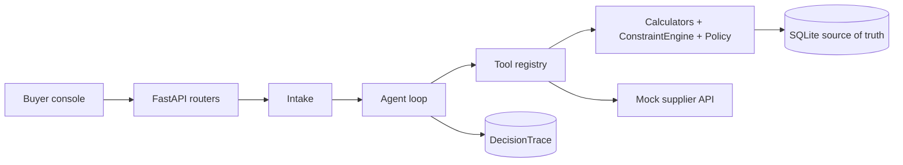
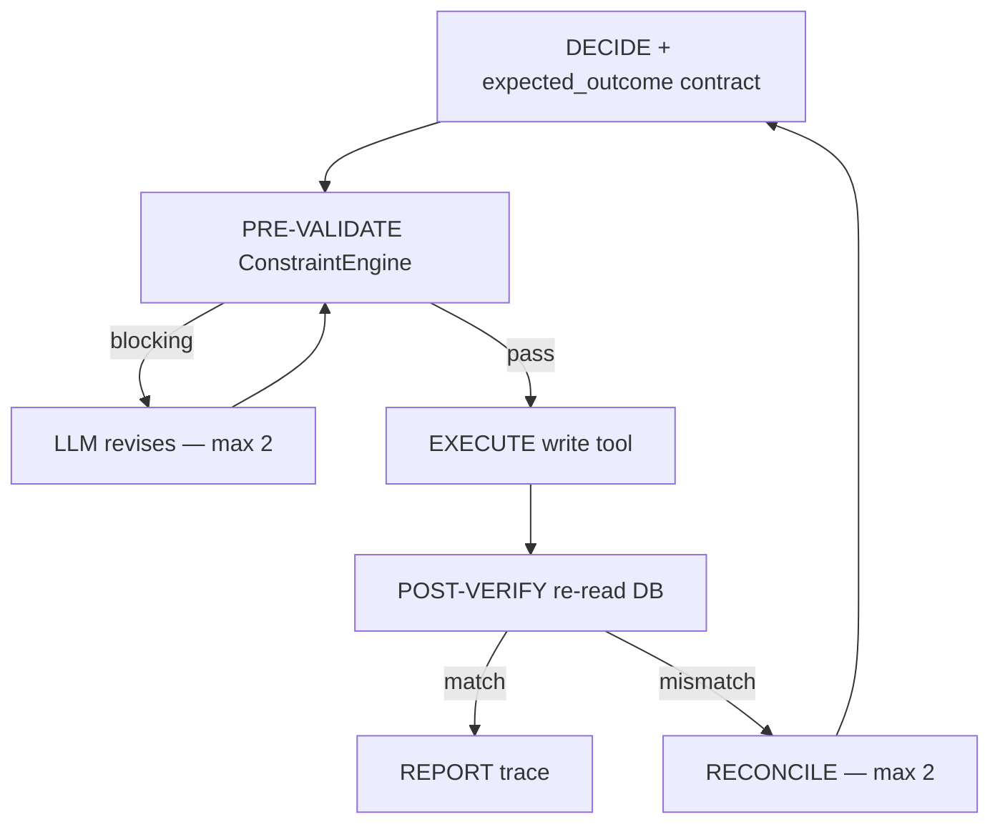
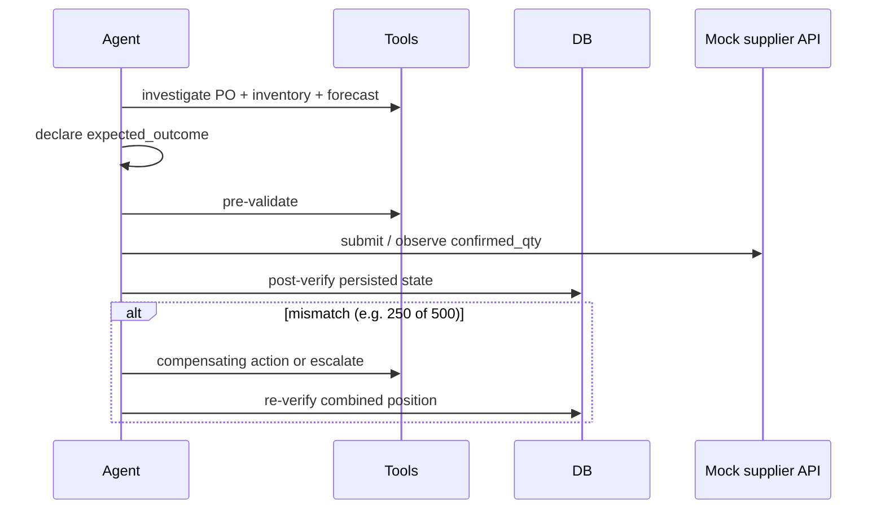

# Architecture

> Scaffold. Full diagrams land in Prompt 8. The mermaid below is the target shape of the system so later prompts fill modules rather than invent structure.

## Request path

## Write-action cycle (non-negotiable)

## Scenario 2 sequence (partial confirmation)

## Data model

ER diagram is added in Prompt 1 / Prompt 8 once tables exist.
