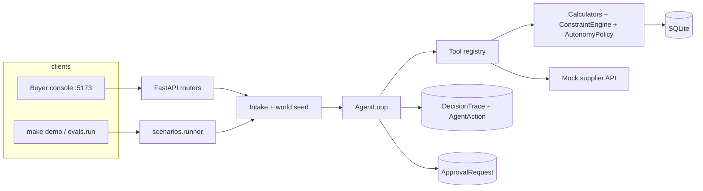
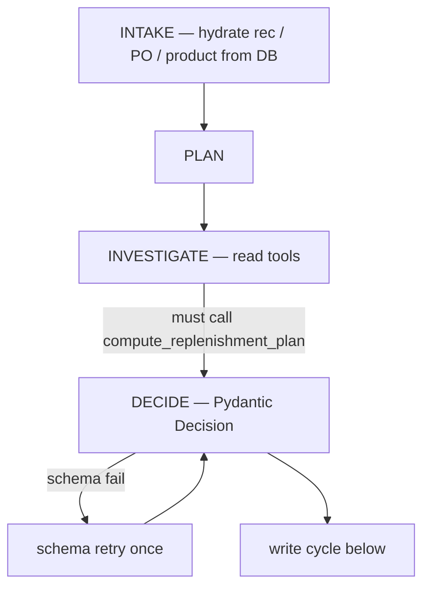
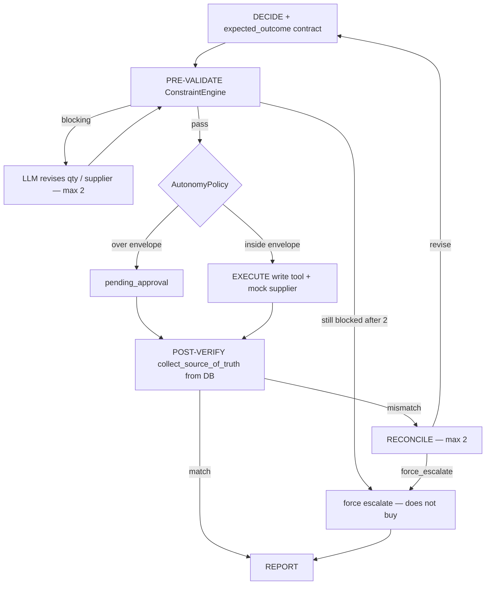
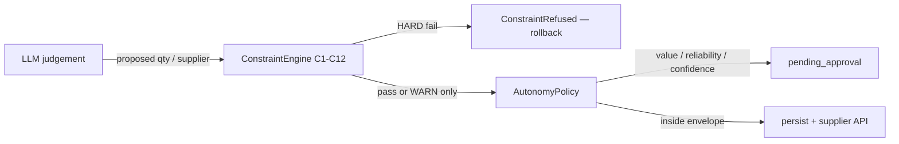
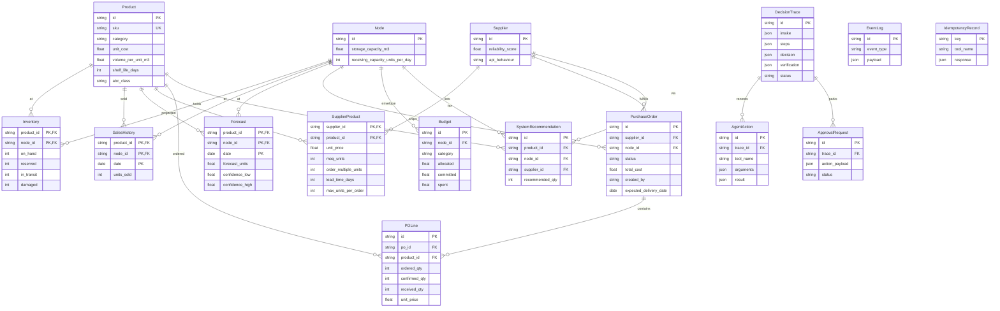

# Architecture

The purchasing agent is a bounded tool-calling loop around a SQLite source of truth. The LLM chooses *what to consider*; Python owns arithmetic, invariants, supplier I/O, and the audit trail.

Clock is frozen at **2026-09-15**. Default LLM is FakeLLM (canned scripts). There is no LangChain / LangGraph.

## Module map

```
frontend/                 operator console (Situations, Run, Validation, Approvals, POs, Evals)
backend/app/
  api/                    FastAPI routers
  agent/
    loop.py               INTAKE → PLAN → INVESTIGATE → DECIDE → PRE-VALIDATE → ACT → POST-VERIFY → RECONCILE → REPORT
    validator.py          ConstraintEngine assemble-from-DB, expected_outcome diff, reconcile cap 2
    schemas.py            Decision, ExpectedOutcome, VerificationReport
    llm.py                Anthropic + FakeLLM
    prompts.py            system / plan / decide / validate-retry / reconcile
  domain/
    calculators.py        C-adjacent maths (cover, SS, ROP, rounding, cost, cube)
    constraints.py        C1–C12 engine
    policy.py             autonomy envelope ($5000 / 0.70 / 0.60)
  tools/                  registry + read_tools + write_tools
  services/supplier_api.py
  db/                     ORM, seed, frozen clock
  scenarios/              catalogue, canned scripts, runner
  demo.py                 `python -m app.demo` — S1 in the terminal
backend/fixtures/         YAML worlds
backend/evals/            YAML cases + seven-dimension grader
```

## Request path

A console click or `POST /agent/run/{scenario}` is the same path as `python -m app.demo`.



HTTP surface:

| Method | Path | Notes |
| --- | --- | --- |
| GET | `/health` | `{"status":"ok","service":"purchasing-agent"}` |
| GET | `/scenarios` | Four-scenario catalogue |
| POST | `/scenarios/{id}/seed` | Reseed that world |
| POST | `/agent/run` | Generic `{intake, script?}` |
| POST | `/agent/run/recommendation-review` | S1 |
| POST | `/agent/run/supplier-shortfall` | S2 |
| POST | `/agent/run/demand-change` | S3 |
| POST | `/agent/run/constrained-buy` | S4 |
| GET | `/traces`, `/traces/{id}` | Audit |
| GET/POST | `/approvals…` | Approve / reject / modify-and-approve (re-verifies) |
| GET | `/pos` | Purchase orders |
| GET/POST | `/evals`, `/evals/run` | Harness |

`execute_scenario(..., seed=True)` rolls back the session, reseeds the scenario world, then runs `AgentLoop` on a fresh session. Caps: **12** LLM turns, **80k** tokens, tool results clipped at 12k chars.

## Agent stages



INVESTIGATE may loop on tool calls. The loop records `called_replenishment` and will not emit a buy Decision until `compute_replenishment_plan` has run.

## Write-action cycle (non-negotiable)

Every `accept` / `modify` that implies a buy, and every explicit write tool, goes through this cycle. The LLM cannot skip PRE-VALIDATE or POST-VERIFY. ConstraintEngine input is assembled from the DB so the model cannot smuggle a hand-built `ProposedAction`.



`expected_outcome` fields compared when not `None`:

`po_status`, `ordered_qty`, `committed_cost`, `budget_remaining_after`, `storage_used_after`, `projected_cover_days`, `stockout_risk`, `expected_delivery_date`.

Numeric compare uses 1% / 0.05 slack. POST-VERIFY does **not** trust the tool return: `collect_source_of_truth` re-reads `PurchaseOrder`, lines, budget, and recomputes cover.

Idempotency: write tools key on `idempotency_key` in `IdempotencyRecord`. A retried create cannot double-order.

## Scenario 2 sequence (partial confirmation + recovery)

World: `supplier_shortfall`. Intake: `PO-SHORTFALL` ordered 500, confirmed 250 of `SKU-ALT` at `DC-NORTH`. Fixture already persisted the short — the agent is deciding what to do *about* it.

Happy path is E8 (`gap`): cover does **not** hold, so the agent creates a **new** PO on `SUP-FAST` for 80 (not a split of Acme — different supplier). Covered path is E7: overlay on-hand 2000, `accept` the short, **no write**.

```mermaid
sequenceDiagram
  participant Buyer as Console / eval
  participant Loop as AgentLoop
  participant Tools as Tool registry
  participant Eng as ConstraintEngine
  participant DB as SQLite
  participant Sup as Mock supplier API

  Buyer->>Loop: POST /agent/run/supplier-shortfall {po_id: PO-SHORTFALL, confirmed_qty: 250}
  Loop->>DB: seed world supplier_shortfall
  Loop->>Loop: INTAKE hydrate PO (ordered 500, confirmed 250, gap 250)
  Loop->>Tools: get_open_purchase_orders / get_inventory / get_forecast
  Tools->>DB: read
  Loop->>Tools: compute_replenishment_plan(SKU-ALT, DC-NORTH, SUP-RELIABLE)
  Note over Loop: on-hand 70 + 250 arriving 2026-09-22; stockout 2026-09-20
  Loop->>Tools: find_alternate_suppliers
  Tools-->>Loop: SUP-FAST lead 3d, dearer, reliability 0.86
  Loop->>Tools: compute_replenishment_plan(..., SUP-FAST)
  Loop->>Tools: validate_action qty=80 supplier=SUP-FAST
  Tools->>Eng: evaluate ProposedAction from DB facts
  Eng-->>Loop: passed
  Loop->>Loop: DECIDE modify + expected_outcome.po_status=confirmed
  Loop->>Tools: PRE-VALIDATE (assemble-from-DB again)
  Loop->>Tools: create_purchase_order SUP-FAST 80
  Tools->>Eng: _evaluate_or_refuse
  Tools->>Sup: submit
  alt E8 — full accept
    Sup-->>Tools: accepted, confirmed_qty=80
    Tools->>DB: persist confirmed
    Loop->>DB: POST-VERIFY
    DB-->>Loop: po_status=confirmed matches contract
    Loop->>Buyer: REPORT decision=modify qty=80
  else Recovery — supplier partial-confirms or rejects the top-up
    Sup-->>Tools: confirmed_qty < 80 or accepted=false
    Tools->>DB: persist partially_confirmed or cancelled
    Loop->>DB: POST-VERIFY
    DB-->>Loop: diffs e.g. po_status confirmed vs partially_confirmed
    Loop->>Loop: RECONCILE (remaining_rounds=2)
    Loop->>Tools: compensating create/split/cancel or escalate
    Loop->>DB: POST-VERIFY combined cover
    alt still unmatched after 2 rounds
      Loop->>Tools: force escalate (no further buy)
    end
    Loop->>Buyer: REPORT — never matched:true after a broken write
  else E7 — cover already holds
    Loop->>Loop: DECIDE accept, final_quantity=null
    Loop->>Loop: PRE-VALIDATE (no buy)
    Loop->>Loop: ACT (no write)
    Loop->>Buyer: REPORT accept — PO-SHORTFALL stays 250, no new PO
  end
```

A captured **post-verify recovery** (E11, sibling of this path: supplier `force_reject` on an otherwise clean create) is pasted in README §7. The cycle is the same: `expected confirmed` vs `actual cancelled` → RECONCILE → escalate.

## Constraint engine vs policy vs LLM



HARD: C1 budget, C2 storage, C3 MOQ, C4 multiple, C5 max qty, C6 supplier sells SKU, C7 lead vs stockout, C8 redundant open-PO cover, C12 max weeks of supply.

WARN (never refuse): C9 shelf life vs cover, C10 receiving capacity, C11 reliability floor.

## Data model



PO statuses: `draft`, `pending_approval`, `submitted`, `confirmed`, `partially_confirmed`, `received`, `cancelled`. `created_by` is `system` | `agent` | `buyer`.

## Fixture worlds

| World | File | Overlay on base |
| --- | --- | --- |
| `base` | `base_world.yaml` | Canonical catalogue |
| `recommendation_review` | `recommendation_review.yaml` | S1 recs REC-OVERBUY / REC-HEALTHY / REC-MOQ |
| `supplier_shortfall` | `supplier_shortfall.yaml` | `PO-SHORTFALL` 500→250 |
| `supplier_shortfall_covered` | `supplier_shortfall_covered.yaml` | on-hand 2000 for E7 |
| `demand_change` | `demand_change.yaml` | spike vs promo series |
| `constrained_buy` | `constrained_buy.yaml` | tight coffee budget + South cube |

Trade-off SKUs are documented in README §5 and in the header comment of `base_world.yaml`.

## Frontend

React + Vite + Tailwind + TanStack Query. Typed client from OpenAPI (`make openapi`). No mock data — empty states if the API is down. Keyboard `1`–`6` maps to Situations / Run / Validation / Approvals / POs / Evaluation. Run is three columns: live trace, decision, C1–C12 meters + cover chart. Validation paints diffs loudly. Approvals re-enter post-verify on approve.
